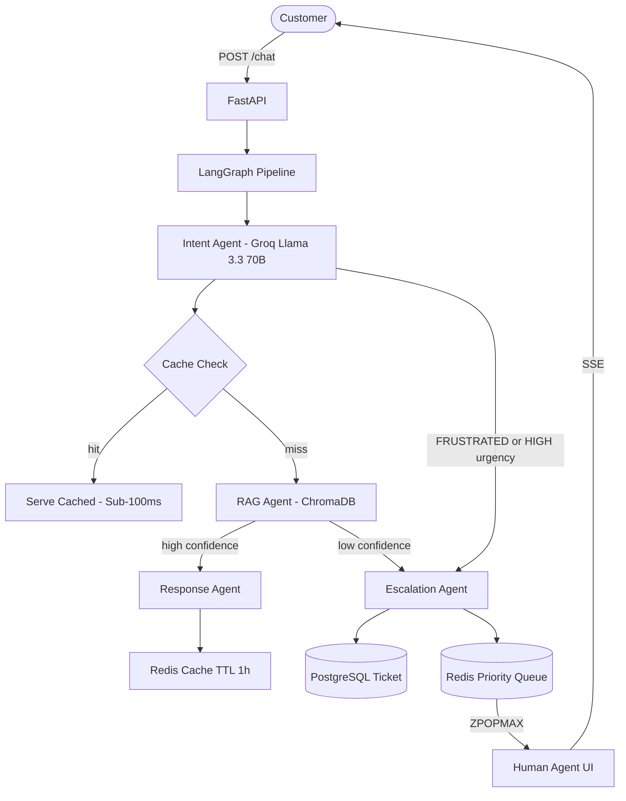

# NexaAgent

Production-grade AI customer operations platform with multi-agent orchestration,
human-in-the-loop handoff, and real-time ops analytics.

## Architecture



## Escalation Decision Tree

- FRUSTRATED sentiment        -> ESCALATE (CRITICAL)
- urgency == HIGH             -> ESCALATE (HIGH)
- intent == escalation_request -> ESCALATE (HIGH)
- user.tier == enterprise     -> ESCALATE (CRITICAL)
- total_turns > 5             -> ESCALATE (MEDIUM)
- kb_confidence < 0.50        -> ESCALATE (COMPLEXITY)
- kb_confidence >= 0.85 AND informational -> AUTO-RESOLVE

## Quick Start

```bash
copy .env.example .env
docker-compose up -d
docker-compose exec backend alembic upgrade head
```

- Customer:  http://localhost:3000
- Agent:     http://localhost:3000/agent
- Ops:       http://localhost:3000/ops
- API docs:  http://localhost:8000/docs

## API Reference

| Method | Path | Description |
|--------|------|-------------|
| POST | /auth/register/user | Register customer |
| POST | /auth/login/user | Customer login |
| POST | /agent/auth/login | Agent login |
| POST | /chat | Full AI pipeline |
| GET | /chat/stream | SSE streaming |
| GET | /agent/queue | Queue + previews |
| POST | /agent/queue/claim | Claim top ticket |
| POST | /agent/tickets/{id}/resolve | Resolve + SLA check |
| GET | /analytics/overview | KPIs 24h/7d/30d |
| GET | /analytics/sentiment_trend | Hourly chart data |